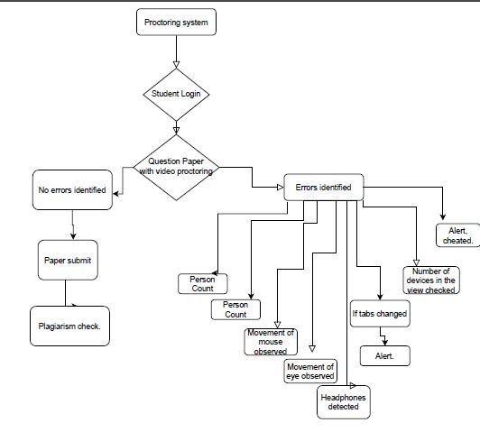

  
  <h3 align="center">Proctorly</h3>
  

    Changing the way teachers take examinations. 
    <a href="https://drive.google.com/file/d/1puIcRyWItdE2-pTWHhgJz0qi02GhnM7B/view?usp=sharing" target="_blank"><strong>Explore the documentation »</strong></a> 
    <a href="https://drive.google.com/file/d/1NHX17gKy4-LE6jCwOkYACrjM3rxl5sKI/view?usp=sharing" target="_blank"><strong>Video Demonstration »</strong></a> 
    <a href="https://proctorly-web1.netlify.app" target="_blank"><strong>Live Link »</strong></a>
  

  
<strong>Introduction</strong>

   
  

    With the onset of COVID-19, students and teachers across the globe were forced to shift to online teaching. The lectures started being held over Google Meet or Zoom, but none of these platforms had a solution for proctoring online examinations.
  

  

    Human proctors were unable to monitor each student carefully, leading to massive cheating and misconduct in exams.
  

  

    <strong>Our vision</strong> was to develop an automated Artificial Intelligence-based proctoring system that:
  

  <ul>
    <li>Replaces human proctors and ensures stricter monitoring</li>
    <li>Detects similarities in student submissions and reports them</li>
    <li>Reduces misconduct and maintains academic integrity</li>
  </ul>

  
<strong>Technologies Used</strong>

   
  
<strong>Integrated Development Environment (IDE):</strong> Google Colab, PyCharm, Replit

  
<strong>Programming Languages:</strong> Python, JavaScript, HTML, CSS, JSX

  
<strong>Frameworks &amp; Libraries:</strong>

  <ul>
    <li>TensorFlow</li>
    <li>Keras</li>
    <li>OpenCV</li>
    <li>NumPy</li>
    <li>Matplotlib</li>
    <li>Speech Recognition</li>
    <li>Scikit-Learn</li>
    <li>ReactJS</li>
    <li>TailwindCSS</li>
    <li>Animate.css</li>
    <li>Tachyons</li>
  </ul>
  
<strong>Deep Learning Architectures Used:</strong>

  <ul>
    <li>Convolutional Neural Network</li>
    <li>Recurrent Neural Network</li>
    <li>YOLOv4 with Darknet</li>
    <li>Gensim.models</li>
    <li>Pyaudio</li>
    <li>Dlib</li>
  </ul>

  
<strong>Workflow</strong>

   
  <ol>
    <li>The teacher/university shares the exam link</li>
    <li>Students log in to the website</li>
    <li>ML models detect cheating attempts in real time</li>
    <li>A log of suspicious activities is sent to the teacher/examiner</li>
    <li>Students submit their exams</li>
    <li>Answers are cross-checked for collaborative cheating</li>
    <li>The final reports (with confidential info redacted) are sent to the teacher</li>
    <li>The result is announced</li>
    <li><strong>Outcome:</strong> No cheating, benefiting both students and teachers!</li>
  </ol>

  
<strong>Flowchart</strong>

   
  

    
  

  
<strong>Explanation of the Models</strong>

   
  <ol>
    <li><strong>Mouth Movement Tracking:</strong> Detects if a student speaks during the exam.</li>
    <li><strong>Person Counting:</strong> Detects the number of individuals in the room.</li>
    <li><strong>Malicious Object Detection:</strong> Identifies cheating materials (books, phones, notes, etc.).</li>
    <li><strong>Answer Similarity Checker:</strong> Identifies collaborative/direct copying in student responses.</li>
    <li><strong>Speech Recognition Surveillance:</strong> Detects spoken words related to the exam questions.</li>
    <li><strong>Headphone Detection:</strong> Checks if a student is using an audio device.</li>
    <li><strong>Eye Tracking:</strong> Monitors eye movements to detect suspicious behavior.</li>
  </ol>

  
<strong>Website Features</strong>

   
  <ul>
    <li><strong>Tab Switch Detection</strong></li>
    <li><strong>Copy-Paste Detection</strong></li>
    <li><strong>Warning System</strong></li>
    <li><strong>User-Friendly Interface</strong></li>
  </ul>

  
<strong>Special Features</strong>

   
  <ol>
    <li><strong>Parallel Processing:</strong> Multi-threaded models ensure low latency and high efficiency.</li>
    <li><strong>Privacy-Focused:</strong> No student data is stored; reports contain limited anonymized data.</li>
    <li><strong>Zero Setup:</strong> Students don’t need any additional hardware or software.</li>
    <li><strong>Student-Centric:</strong> Designed to be stress-free for students while ensuring fairness.</li>
    <li><strong>Cost-Effective:</strong> AI-based monitoring is cheaper than hiring human proctors.</li>
  </ol>

  
<strong>Why Our Solution is Better</strong>

   
  <ol>
    <li><strong>Higher Accuracy:</strong> AI ensures each student is monitored at all times.</li>
    <li><strong>Immediate Action:</strong> Anomalies are reported in real time.</li>
    <li><strong>Remote Accessibility:</strong> Can be deployed for online examinations easily.</li>
    <li><strong>Privacy-Focused:</strong> No recorded videos or images are stored, preventing misuse.</li>
  </ol>

  
<strong>Future Scope</strong>

   
  <ol>
    <li>Develop a full-fledged commercial product.</li>
    <li>Enhance the accuracy of the headphone detection model.</li>
    <li>Use improved datasets for better model performance.</li>
    <li>Optimize model efficiency with better algorithms.</li>
    <li>Create an end-to-end proctoring solution for universities.</li>
  </ol>

<!-- FOOTER -->

  💙 If you like this project, give it a ⭐! In case of any bugs or feedback, feel free to contact me.

